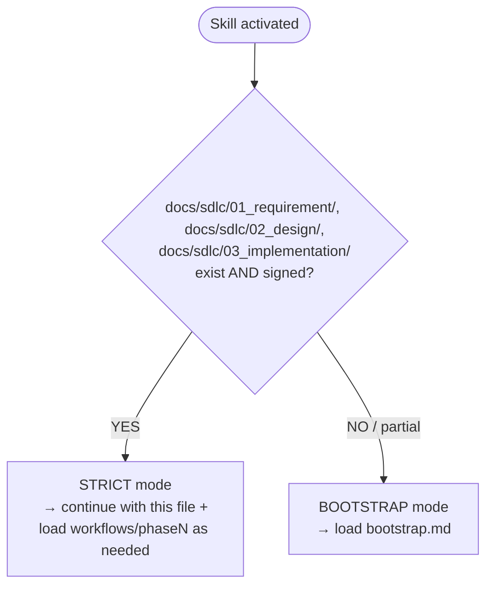

---
# === Doc-lifecycle schema (enforced by scripts/check_frontmatter.py) ===
doc: skill/SKILL.md
status: signed
signed_by: Thanin Piromward on 2026-04-23
required_for: ["phase-1-artifact-authoring", "phase-2-artifact-authoring", "phase-3-slice", "phase-3-refactor", "phase-4-test-authoring", "phase-4-test-execution", "phase-5-deploy-prep", "phase-5-release-cutting", "phase-6-CR-authoring", "phase-6-CR-implementation", "phase-6-incident-response", "phase-6-routine-maintenance"]
cite_as: SKILL

# === Claude Code skill-loader fields (read by the /sdlc-strict-waterfall Skill tool) ===
# Both field sets coexist in one block per the dual-schema convention
# documented at schemas/doc-frontmatter.schema.yaml — Claude Code ignores the
# lifecycle fields above; the validator ignores the skill-loader fields below.
name: sdlc-strict-waterfall
description: Enforces strict waterfall SDLC where signed-off documents in docs/sdlc/01_requirement → docs/sdlc/02_design → docs/sdlc/03_implementation → docs/sdlc/04_testing → docs/sdlc/05_deployment → docs/sdlc/06_maintenance are the source of truth. Use whenever working in a project with (or that should have) the 6-phase SDLC document tree. Two modes — Bootstrap (co-author docs from scratch via four gated Q&A rounds when the tree is missing) and Strict (normal doc-driven development when the tree exists). Within each slice, TDD is mandatory: write the failing test first (derived from AC-### / TC-###), make it pass with the minimum code, refactor. Phase sign-off requires all four gates plus reconciliation run as two ordered passes (spec compliance → code quality). Includes per-phase workflows, plus protocols for change, migration, hotfix, and removal. Forbids freestyle code, undocumented features, out-of-order phase work, code-before-failing-test, silent deletes, undocumented migrations, and phase sign-off without reconciliation.
---

# SDLC Strict Waterfall — Document-First Development

## Overview

In this workflow, **the documents are the product**, and the code is just one realization of them. Code that doesn't trace to a signed-off document is a bug, not a feature.

The 6-phase SDLC tree is:

```mermaid
flowchart LR
    P1["docs/sdlc/01_requirement<br/>WHAT"]
    P2["docs/sdlc/02_design<br/>HOW"]
    P3["docs/sdlc/03_implementation<br/>BUILD ORDER"]
    P4["docs/sdlc/04_testing<br/>PROOF"]
    P5["docs/sdlc/05_deployment<br/>SHIP"]
    P6["docs/sdlc/06_maintenance<br/>OPERATE"]
    P1 -->|tc+lint+tests+recon+sign| P2
    P2 -->|tc+lint+tests+recon+sign| P3
    P3 -->|tc+lint+tests+recon+sign| P4
    P4 -->|tc+lint+tests+recon+sign| P5
    P5 -->|tc+lint+tests+recon+sign| P6
```



You may NOT skip phases, work out of order, or write code that has no document parent.

## When to use

Activate this skill whenever:

- The project root contains directories matching `0[1-6]_*` (the SDLC tree).
- The user invokes `/sdlc-strict-waterfall` explicitly.
- The user says anything like "follow the SDLC docs", "strict waterfall", "doc-driven", "no freestyle".

Default to this skill if the doc tree exists.

## Two modes — pick first, then load the right file



Signed = explicit "Signed off by <name> on YYYY-MM-DD" line (or project equivalent). If the tree is partially present but not signed → Bootstrap, resume from first unsigned gate.

## Core rules — NON-NEGOTIABLE

1. **Read before you write.** Consult `skill/references/required-reads.md` for the current task-type. Load every file listed under `must_read` — not a subset, not a judgment call. State which docs authorize the change using the `must_cite_in_opening` template for that task-type.
2. **Phase order is law.** Outer phase order: requirements signed → design signed → implementation begins → tests green → **reconciliation closed (two ordered passes)** → phase signed → next phase opens → ... → deploy. (Within an implementation slice, TDD inverts test vs code locally — see rule 7. Reconciliation runs Pass 1 (spec compliance) then Pass 2 (code quality).)
3. **One file at a time, traceable to a doc section.** Every file you create/edit must trace to a section in `module_breakdown.md` or its equivalent.
4. **No freestyle.** If the docs don't specify it, don't build it. No "obvious" extras, no bonus helpers, no "while I'm here" refactors.
5. **Document-first protocol for any change.** If implementation reveals the docs need to change → load `protocols/change.md`. STOP coding, propose the doc edit, get user confirmation, update the doc, THEN resume coding. Never the other way around.
6. **Sign-offs are sacred.** A signed-off document is frozen. To amend, append a `## Post-vX.Y.Z Amendments (YYYY-MM-DD)` section rather than editing in-place — unless the existing prose is actively misleading (counts, names, response shapes), in which case in-place fix is permitted.
7. **TDD inside every slice.** For each TO-###: write the failing test first (from AC-### / TC-### in the signed docs — never invent behavior), watch it fail, write the minimum code to make it pass, then refactor with the test still green. Tests trace to AC; code traces to tests. Exception: UI rendering, config, and generated code may be test-after where no meaningful unit test adds value — state the reason explicitly when skipping.
8. **Code is the source of truth for enums, lists, and constants.** When the same enum / list / constant appears in both code and docs (role names, artifact types, status enums), the code is canonical. Docs reference the code path (e.g., "see `src/server/artifacts/templates.ts: ARTIFACT_TYPES`"); they do NOT duplicate the values. Duplication guarantees drift.
9. **Phase gates require ALL four checks AND two-pass reconciliation.** A phase is not signed until: typecheck passes + lint passes + full test suite green + reconciliation gate closed (`reconciliation.md`), with **Pass 1 (spec compliance) closed BEFORE Pass 2 (code quality) opens**. "Tests green" alone is insufficient — typecheck and lint catch a different class of drift.
10. **User-initiated code-change requests MUST route through docs first.** When the user says "adjust this code", "add this function", "fix this", "change this behavior", or any direct-edit request — **REFUSE the direct route.** A direct code-change request without prior doc work is a process violation, regardless of who asks. Route to:
    - **During initial development (any phase before live):** invoke `protocols/change.md` — discuss the requirement → propose doc amendment (which 01/02/03 doc, which section, what new text) → user signs the amendment → THEN write the code.
    - **Post-launch (project is live, v1+ shipped):** invoke the CR workflow in `workflows/phase6-maintenance.md` — discuss → open CR-### in `docs/sdlc/06_maintenance/change_requests.md` → amend the relevant docs (FR / UC / AC / design) and obtain sign-off → re-enter SDLC at the appropriate phase.

    This applies to "small" changes, "obvious" fixes, and "just one line" edits — there are no exceptions. "Just adjust the code, it's quick" is the canonical wrong path. The doc-first gate is non-negotiable: refuse the direct edit and re-route.

## Model selection per phase

Capability tiers — defined by behavioral signal + approximate price band:

| Tier        | Capability signal                                    | Input price band (USD/M) | Example (2026-04)       |
|-------------|------------------------------------------------------|--------------------------|-------------------------|
| `cheap`     | Tool-use fluent; single-step; short-context mechanical tasks | ≤ $1 / M           | Haiku 4.5               |
| `standard`  | Multi-turn reasoning; multi-file integration; moderate-context debugging | $1–$5 / M | Sonnet 4.6            |
| `capable`   | Long-horizon planning; architectural judgment; open-ended problem solving | > $5 / M | Opus 4.7              |

Price bands are INFORMATIONAL (updated from `config/pricing.yaml` via
`scripts/sync_tiers.py`); the authoritative signal is the capability row.
Adopters on different vendors (OpenAI, Gemini) map by capability, not price.

Phase × task-type recommendation:

| Phase | Task type                                  | Tier      | Why                                        |
|-------|--------------------------------------------|-----------|--------------------------------------------|
| 01    | Authoring srs.md / FRs / NFRs              | capable   | Domain synthesis, precedent-aware          |
| 02    | Architecture + data model decisions        | capable   | Long-horizon tradeoff reasoning            |
| 02    | API endpoint enumeration                   | standard  | Pattern-application over signed designs    |
| 03    | Mechanical TDD slice (1-2 files)           | cheap     | Spec-to-code translation                   |
| 03    | Multi-file integration slice               | standard  | Coordination across modules                |
| 03    | Spec ambiguity → divergence triage         | capable   | Judgment about docs vs. code               |
| 04    | Running / parsing test results             | cheap     | Structured output extraction               |
| 04    | Analyzing test failures                    | standard  | Root-cause reasoning                       |
| 05    | Runbook / release notes authoring          | standard  | Structured prose with constraints          |
| 06    | Routine CR authoring                       | standard  | Template-following + judgment              |
| 06    | Reconciliation Pass 2 (code quality)       | capable   | Broad codebase evaluation                  |

Overrides permitted with a one-line justification in the commit message or CR
body (`tier-override: <task-type> <from>→<to> reason=<text>`).

Model IDs and exact pricing live canonically in `config/pricing.yaml` per Core
rule 8; this table uses tiers, not IDs.

## Delegating a slice to a subagent

**When mandatory** (FR-MDL-003): slices touching ≥ 2 files OR estimated ≥ 1 hour
OR spanning multiple FRs. Single-file < 1h slices may be executed directly.

**Controller responsibilities:**

- Read the signed 01/02/03 docs authorizing the slice.
- Extract the full TO-### text, AC-### items to satisfy, file paths, and
  relevant doc excerpts.
- Dispatch a fresh subagent with the extracted bundle.
- Do NOT tell the subagent to "read the docs" — provide the needed quotes
  verbatim.

**Subagent responsibilities:**

- Implement, follow TDD per Core rule 7, report back.
- Do NOT read any file outside the provided paths.
- Do NOT expand scope beyond the extracted bundle.
- Return `{status, files_changed, tests_added, self_review_notes}`.

**Controller responsibilities on return:**

- Run reconciliation Pass 1 (spec compliance) — see `skill/reconciliation.md`.
- Loop back to subagent for fixes if needed.
- Run reconciliation Pass 2 (code quality) when Pass 1 is clean.

## Document map by phase

### docs/sdlc/01_requirement — what to build
`srs.md`, `functional_requirements.md` (FR-001..NNN), `non_functional_requirements.md` (NFR-*), `use_cases.md` (UC-001..NNN), `acceptance_criteria.md`, `stakeholders.md`, `glossary.md`, `system_vision.md`, `assumptions_and_constraints.md`

### docs/sdlc/02_design — how to build
`architecture.md`, `data_model.md`, `database_design.md`, `api_design.md`, `sequence_diagrams.md`, `ui_design.md`, `trade_offs.md`

### docs/sdlc/03_implementation — how to write the code
`coding_standards.md`, `module_breakdown.md` (THE traceability map), `development_plan.md`, `task_list.md` (TO-001..NNN), `branching_and_commits.md`, `code_review_checklist.md`, `build_and_run.md`, `traceability_matrix.md`

### docs/sdlc/04_testing
`test_plan.md`, `test_cases.md` (TC-001..NNN), `test_data.md`, `test_report.md`, `defect_log.md`, `uat_plan.md`, `perf_baseline.json`

### docs/sdlc/05_deployment
`deployment_plan.md`, `release_notes.md`, `rollback_plan.md`, `runbook.md`, `smoke_tests.md`, `go_live_checklist.md`

### docs/sdlc/06_maintenance
`maintenance_plan.md`, `incident_log.md`, `change_requests.md`, `sla_and_slo.md`, `monitoring.md`, `eol_policy.md`

(Exact filenames may vary per project — adapt to the actual tree but keep the phase order.)

## When to read which file

This SKILL is the always-loaded dispatcher. Load detail files **only when** the trigger fires:

| Situation | File to load |
| --- | --- |
| Doc tree missing or partial → co-authoring docs | `bootstrap.md` |
| Starting a Phase 3 TO-### slice (TDD loop) | `workflows/phase3-implementation.md` |
| Phase 3 signed; moving into testing | `workflows/phase4-testing.md` |
| Phase 4 signed; cutting a release | `workflows/phase5-deployment.md` |
| Project is live; incidents / CRs / monitoring | `workflows/phase6-maintenance.md` |
| **User asks to "adjust code" / "add function" / "fix" / any direct code change** | **`workflows/phase6-maintenance.md` (CR workflow if live) OR `protocols/change.md` (if pre-launch) — REFUSE direct edit, route to doc-first** |
| Found a doc-vs-code divergence; want to amend a doc | `protocols/change.md` |
| About to modify DB schema / persisted data shape / shared config | `protocols/migration.md` |
| Live system broken vs SLO; need emergency lane | `protocols/hotfix.md` |
| About to delete code, file, endpoint, field, or behavior | `protocols/removal.md` |
| Phase complete; running the end-of-phase audit | `reconciliation.md` |
| Updating `traceability_matrix.md` or auditing AC ↔ TC ↔ code links | `traceability-matrix.md` |
| Authoring or reviewing any diagram in any phase doc | `references/mermaid-conventions.md` |
| Authoring `coding_standards.md` / `build_and_run.md` / `module_breakdown.md` | `references/stack-aware-authoring.md` |

Do not load files speculatively — only when the trigger applies. Load multiple if multiple triggers fire.

## What this skill BLOCKS

- Writing code without first reading the relevant 01/02/03 docs
- Adding endpoints, fields, parameters, or behaviors not in the docs
- Architectural decisions not recorded in `architecture.md`
- New dependencies not listed in `module_breakdown.md`
- API shape changes without updating `api_design.md` first
- Schema changes without updating `data_model.md` + `database_design.md` first
- "Cleanup" or refactors not on the `task_list.md`
- Skipping phases (writing code before design is signed; marking a phase done before its AC-### tests pass)
- Writing production code before a failing test exists for the slice (outside the stated UI/config/generated exception)
- Signing off a phase without first running the Reconciliation Gate to green
- Closing a Reconciliation Gate without explicit per-item bucket assignment + user-confirmed direction on every Bucket B
- Editing signed-off documents in-place (use Post-vX.Y.Z Amendments instead, unless misleading)
- Signing off a phase with typecheck or lint failures (Core rule 9 — all four gates required)
- Deleting a file, endpoint, field, or behavior without going through the removal protocol
- Applying a schema or data migration without first amending `data_model.md` + `database_design.md`
- Treating an urgent feature request as a hotfix (urgency ≠ incident)
- Skipping the post-hoc reconciliation step on a hotfix
- Duplicating an enum, list, or constant value in a doc (Core rule 8 — docs reference the code path)
- Marking an NFR-### "validated" without an evidence artifact in `docs/sdlc/04_testing/`
- Starting Phase N+1 work while Phase N's traceability_matrix has empty TC or Code cells
- Authoring diagrams in any phase doc using ASCII art, screenshots, or non-Mermaid formats (see `references/mermaid-conventions.md`)
- Accepting a user request to directly adjust source code or add a function without first routing through doc amendment + sign-off (Core rule 10) — pre-launch via `protocols/change.md`, post-launch via CR-### in `workflows/phase6-maintenance.md`. "Small" changes are not exempt.

## Verification checklist (before declaring any task done)

- [ ] I read the 01 spec(s) that authorize this work
- [ ] I read the 02 design(s) that specify how
- [ ] I located the file in `module_breakdown.md`
- [ ] A failing test was written FIRST, derived from AC-### / TC-### (or the test-after exception is stated with reason)
- [ ] The failing test now passes; I watched it go red → green
- [ ] The implementation matches the spec **verbatim** (names, types, errors, responses)
- [ ] The code follows `coding_standards.md`
- [ ] `acceptance_criteria.md` items for this slice are satisfied
- [ ] The test is cataloged in `docs/sdlc/04_testing/test_cases.md` with its TC-### ↔ AC-### link
- [ ] No undocumented behavior was introduced
- [ ] If anything diverged: docs were amended **first** with explicit user approval (`protocols/change.md`)
- [ ] Cited the doc sections in my update message
- [ ] Typecheck and lint pass (Core rule 9 — all four phase gates)
- [ ] `traceability_matrix.md` row updated for the AC-### with TC, code, commit
- [ ] No enum / constant / list values were duplicated into docs (Core rule 8)
- [ ] If a deletion was involved: `protocols/removal.md` followed (trace → amend → deprecate → remove)
- [ ] If a schema/data change was involved: `protocols/migration.md` followed (data_model + database_design amended → dry-run → backup → apply → verify)
- [ ] If this was a hotfix: incident logged, regression test written, post-hoc reconciliation queued for next gate

## Communication template

When starting work, lead with:

```
Implementing per:
- docs/sdlc/01_requirement/<file>.md §<section> — <spec name>
- docs/sdlc/02_design/<file>.md §<section> — <design name>
- docs/sdlc/03_implementation/module_breakdown.md → <file path>

Slice: <one-sentence scope>
```

When done:

```
Done. Implementation matches:
- <doc>:<section> — <how>
- AC <ID>: <verification>
TDD loop: RED (<test name> → <expected failure>) → GREEN → REFACTOR
Tests run: <pass/fail summary>
Cataloged: <TC-### in test_cases.md>
```

When you encounter a divergence:

```
HALT — divergence detected:
- Docs say: "<quote>" (<file>:<section>)
- Implementation needs: <reality>
- Proposed amendment: <file>:<section> → <new text>
Awaiting your approval before proceeding.
```

## Anti-patterns to refuse

- "I'll just add this small helper, it's obvious" — NO. If it's not in the docs, don't.
- "The docs are slightly outdated, I'll update later" — NO. Update them first (`protocols/change.md`).
- "I'll refactor this while I'm here" — NO. Stay surgical.
- "Let me make this more robust by adding X" — NO. Match the spec.
- "I'll write tests first to drive the design" — distinguish: NO if it means inventing behavior the docs don't authorize. YES (required) if it means writing a failing test derived from AC-### / TC-### before the production code. The design doc drives the WHAT; the failing test drives the immediate coding loop.
- "I'll write the code first, then backfill the test" — NO. The red → green → refactor order is the point of TDD. A test written after the code no longer proves the code works; it only proves the test agrees with whatever was typed.
- "Let me skip the docs and code; we can document after" — NO. Documents come first, always.
- "This file looks unused, I'll delete it" — NO. Use `protocols/removal.md`. Trace before you delete.
- "It's just a column rename; I'll skip the dry-run" — NO. Migrations always dry-run + backup, no exceptions (`protocols/migration.md`).
- "We need to ship the hotfix now; I'll skip the regression test" — NO. The test is what stops it recurring. Hotfixes obey TDD too (`protocols/hotfix.md`).
- "I'll list the enum in the doc for clarity" — NO. Code is the source of truth (Core rule 8). Doc references the code path; no duplication.
- "Tests pass, that's enough to sign off" — NO. Phase sign-off requires typecheck + lint + tests + reconciliation (Core rule 9).
- "The NFR is intuitively met; we don't need to measure it" — NO. Unmeasured NFRs are aspirational, not requirements. Either measure or amend the NFR.
- "I'll paste a screenshot of the diagram for clarity" — NO. Mermaid only across all phase docs. See `references/mermaid-conventions.md`.
- **User: "Just adjust this code" / "Add a function for X" / "Fix this real quick"** — NO. Core rule 10. Refuse the direct edit and route to doc-first: pre-launch → `protocols/change.md`; post-launch → open CR-### per `workflows/phase6-maintenance.md`. Respond with: "I can't change code directly per Core rule 10. Let's discuss the requirement, then I'll [open CR-### / propose the doc amendment], get your sign-off, then implement."
