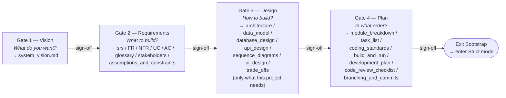

# Bootstrap mode — co-author the docs from scratch

> Read this file when a project lacks signed `docs/sdlc/01_requirement/` (greenfield). Once Bootstrap completes, this file is no longer needed — Strict mode (the main `SKILL.md`) takes over.

**Goal:** work with the user, one gate at a time, to produce the minimum signed documents required to authorize the first slice of code. No code is written until all four gates sign off.

**Principle:** You are co-authoring, not interrogating. Ask one or two questions at a time, draft the doc section, show it back, iterate, then request sign-off.

## Starting scaffolds (already in the project)

Bootstrap.sh ships every phase's docs as `{{PLACEHOLDER}}`-filled scaffolds in the project's own `0X_*/` folders (e.g. `docs/sdlc/02_design/architecture.md`, `docs/sdlc/03_implementation/coding_standards.md`). They are agent-agnostic — any LLM, IDE, or human can browse `ls 0X_*/` and see the doc shape (C4 tables, FR/NFR/UC/AC sections, etc.) without loading this skill.

When drafting a doc:

1. Read the existing project file (e.g. `docs/sdlc/02_design/architecture.md`) — that's your scaffold.
2. Use its section structure verbatim — these are the conventional headings the rest of the skill (and the phase `README.md` exit criteria) expect.
3. Replace every `{{PLACEHOLDER}}` with the user's actual answers from the gate Q&A.
4. Delete sections that don't apply to this project (e.g. drop `database_design.md` entirely if there's no DB) — don't ship empty boilerplate.
5. Write the result back to the same path. Each phase's `README.md` in the project (`0X_*/README.md`) lists the docs + exit criteria — confirm against it before requesting sign-off.

## The four bootstrap gates

Each gate: Q&A → draft → review → sign-off → next gate.

## Gate 1 — Vision ("What do you want?")

Ask these one at a time (NOT all at once):

1. In one sentence, what problem does this project solve, and for whom?
2. What's the smallest shippable version — what's IN and what's OUT?
3. What are 3–5 success criteria? (how will you know it's working?)
4. Any hard constraints? (language, framework, platform, budget, deadline, "must integrate with X")
5. Any non-negotiable no-gos? (techs to avoid, patterns to refuse)

Draft `docs/sdlc/01_requirement/system_vision.md` capturing the answers. Show it to the user. Iterate until they're happy. Then ask:
> "Ready to sign off on system_vision? If yes, I'll append `Signed off by <your name> on <YYYY-MM-DD>` and move to Gate 2."

## Gate 2 — Requirements ("What to build?")

Ask (one or two at a time):

1. Walk me through the main user journeys. Who does what, in what order, to get value?
2. For each journey, what must be true for it to "work"? (functional requirements)
3. What qualities beyond functionality matter? (performance, reliability, security, accessibility) — tied to which specific flows?
4. What data does the system hold? Nouns (entities) and how they relate.
5. For each requirement, what's the concrete acceptance test — given/when/then?
6. Domain vocabulary — any terms that need a shared definition?
7. Who are the stakeholders, and who signs what?

Produce the subset the project needs (start minimal):

- `functional_requirements.md` — FR-001..NNN
- `non_functional_requirements.md` — NFR-*
- `use_cases.md` — UC-001..NNN
- `acceptance_criteria.md` — AC-001..NNN (each cites an FR or UC)
- `glossary.md`
- `srs.md` — roll-up / index referencing all siblings
- `stakeholders.md`
- `assumptions_and_constraints.md`

Iterate with the user section-by-section. Then request sign-off on Phase 1 before Gate 3.

## Gate 3 — Design ("How to build?")

Ask (one or two at a time):

1. Given the FRs, what are the natural components/layers? Where do boundaries fall?
2. How does data flow between them? (sequence diagram per key use case)
3. What's the concrete data model? Entities → fields → relationships → constraints.
4. Is there an external interface? (REST, MCP, CLI, UI) For each endpoint: request shape, response shape, errors, status codes.
5. If there's a UI: main screens, components, states, navigation.
6. What tradeoffs are we accepting? (record in `trade_offs.md` as ADRs)

Produce ONLY the docs this project needs — don't generate boilerplate for irrelevant sections:

- `architecture.md` — always
- `data_model.md` — if there's persisted state
- `database_design.md` — if a DB is in scope
- `api_design.md` — if there's an external interface
- `sequence_diagrams.md` — for the 3–5 core flows
- `ui_design.md` — if there's a UI
- `trade_offs.md` — for every non-obvious decision

All diagrams must be Mermaid — see `references/mermaid-conventions.md`.

Iterate. Request sign-off on Phase 2 before Gate 4.

## Gate 4 — Plan ("In what order?")

Ask (one or two at a time):

1. What's the dependency order? What must exist before what?
2. What's the smallest vertical slice that proves the architecture end-to-end? (that's TO-001)
3. What coding conventions matter? (naming, tests, error handling, file layout) — **anchor in the chosen stack's idioms** (see `references/stack-aware-authoring.md`).
4. How do we run, test, and build this locally? (commands must match the stack's standard tooling — `pnpm` for Node, `uv`/`poetry` for Python, `cargo` for Rust, `composer`/`pint`/`pest` for PHP, etc.)
5. Branching / commit conventions?

Produce:

- `module_breakdown.md` — file tree → responsibilities (THE traceability map)
- `task_list.md` — TO-001..NNN, each with: spec refs (FR/UC), AC refs, estimate, status
- `coding_standards.md`
- `build_and_run.md`
- `development_plan.md` — build order / milestones
- `code_review_checklist.md`
- `branching_and_commits.md`

Iterate. Request sign-off on Phase 3.

## Sign-off protocol (applies to every gate)

- Sign-off = an explicit line at the bottom of the doc: `Signed off by <name> on YYYY-MM-DD`.
- Never sign off on the user's behalf. If they say "ok" or "looks good", confirm: "Should I record you as signing off `<doc>`? If yes, I'll append the sign-off line and move to Gate N+1."
- Record every sign-off also in a project-level `SIGNOFFS.md` or the equivalent (optional, but useful).
- Once all four gates sign off, announce: "Bootstrap complete. Entering Strict mode." From here, the main body of `SKILL.md` applies.

## Anti-patterns in Bootstrap mode

- Generating all docs at once without Q&A — defeats co-authoring
- Firing all questions of a gate in a single message — wall-of-text; ask 1–2 at a time
- Writing any code before Gate 4 signs off — violates phase order
- Padding docs with boilerplate the user didn't actually agree to
- Auto-inferring a sign-off from ambiguous replies ("sure", "cool", "next") — always confirm explicitly
- Leaving gates half-drafted without closing them before moving on
- Fabricating stakeholder names, dates, deadlines, or success criteria that weren't stated

## Exit conditions

Bootstrap mode ends and Strict mode begins when ALL of:

- Phase 1 (docs/sdlc/01_requirement) is signed
- Phase 2 (docs/sdlc/02_design) is signed
- Phase 3 (docs/sdlc/03_implementation) is signed — at least `module_breakdown.md` + `task_list.md` + `coding_standards.md`
- `task_list.md` has at least one TO-### with status `ready`
