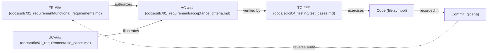

# The traceability matrix

> Read this when authoring `docs/sdlc/03_implementation/traceability_matrix.md`, when completing a TO-###, or when running the reconciliation gate.

A living artifact at `docs/sdlc/03_implementation/traceability_matrix.md` (or per-version) — the spine that closes the loop from spec to commit.

## Edge structure

A complete row has a non-empty value at every node. Any blank is a reconciliation signal.

## Shape

One row per AC-### (or per FR-### if AC-### isn't 1:1):

| FR-### | UC-### | AC-### | TC-### | Code (file:symbol) | Commit |
| --- | --- | --- | --- | --- | --- |
| FR-001 | UC-001 | AC-001 | TC-001 | `src/foo/bar.ts:doThing` | `abc123` |
| FR-002 | — | AC-002, AC-003 | TC-002, TC-003 | `src/foo/baz.ts:doOther` | `def456` |

## When to update
- New FR / AC added → new row.
- TO-### completes → fill TC, code, commit columns for its row(s).
- Reconciliation gate → walk the matrix; empty cells are signals:
  - **Empty TC** → AC has no test → Bucket A (must add test).
  - **Empty Code** → AC has no implementation → either still TODO (defer to TO-###) or genuinely orphaned (remove via removal protocol).
  - **Empty AC** for a non-empty Code row → orphan code → reconciliation candidate (Bucket B or removal).

## Why
TDD links test → code; the matrix links AC → test → code → commit. Without it, reconciliation hunts blind. With it, reconciliation is "scan the matrix for blanks." It is also the first artifact to consult when a downstream phase asks "is this feature shipped?"

## Generation
Hand-curated initially. Once stable, can be auto-generated by scanning frontmatter on AC-### / TC-### sections + `git log --grep TO-###`. Keep in source control alongside `task_list.md`.
