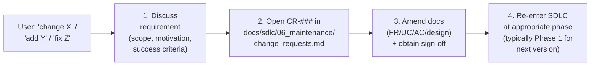

# Phase 6 — Maintenance workflow

> Read this when the project is live. Phase 6 doesn't sign off — it persists. Three sub-workflows below.

## Incident handling
1. Open an entry in `docs/sdlc/06_maintenance/incident_log.md` immediately: timestamp, severity, scope, oncall.
2. Triage: hotfix path (see `protocols/hotfix.md`) or full-cycle change?
3. Resolve. Update incident entry with timeline, root cause, fix, links to commits/PRs.
4. Post-mortem if severity ≥ threshold defined in `sla_and_slo.md`. File the post-mortem in the incident entry.

## Change requests (the ONLY path for post-launch code or feature changes)

**Per Core rule 10: ANY user request to "adjust code", "add a function", "fix this", or "change behavior" in a live project MUST flow through this workflow. Direct code edits are forbidden — refuse and re-route.**

### The 4-step flow (non-negotiable)



#### Step 1 — Discuss the requirement
Before any artifact is created, establish: WHAT does the user want, WHY (motivation / problem solved), and WHAT does "done" look like (success criteria). If the user says "just change line 42" — STOP and ask for the underlying need. The CR captures intent, not edits.

#### Step 2 — Open CR-### in `docs/sdlc/06_maintenance/change_requests.md`
A new feature or change post-launch starts as a CR-###, NOT directly in `docs/sdlc/01_requirement/`.

CR-### entry must include:
- **Requestor** (who asked)
- **Date opened** (YYYY-MM-DD)
- **Motivation** (the why from Step 1 — the problem, not the proposed code)
- **Scope** (what's IN, what's OUT)
- **Success criteria** (how we'll know it works)
- **Target version** (e.g., v1.1.0)
- **Status** (`proposed` / `accepted` / `rejected` / `in-design` / `in-impl` / `shipped`)
- **Cross-refs** (links to FR-### / UC-### / AC-### / TC-### created downstream — populated as the CR progresses)

The user reviews the CR. On acceptance, mark it `accepted` and proceed to Step 3.

#### Step 3 — Amend the docs and obtain sign-off
Open the corresponding FR-### / UC-### / AC-### in `docs/sdlc/01_requirement/` (cross-referencing the CR-###). If the change touches design (architecture, data model, API), amend the relevant 02 docs too via the change protocol (`protocols/change.md`). Each amended doc gets a sign-off line (or a `## Post-vX.Y.Z Amendments (YYYY-MM-DD)` section, depending on whether the existing prose is misleading or just additive).

**The sign-off is a hard gate.** No code is written until the user has signed every amended doc.

#### Step 4 — Re-enter SDLC at the appropriate phase
With docs amended and signed, re-enter the standard workflow:
- New FR/UC/AC → re-enter at Phase 1 (already done in Step 3) → Phase 2 design (if needed) → Phase 3 implementation (TDD per `workflows/phase3-implementation.md`) → Phase 4 testing → Phase 5 deployment.
- Pure design change (e.g., refactor authorized by an ADR) → enter at Phase 2.
- Pure 03/04 change (e.g., test added) → enter at Phase 3.

The CR-### travels with every downstream artifact (TO-###, TC-###, commit messages, PR titles) so the trail is intact.

### Refusal templates

When a user attempts a direct code-change request, respond with one of:

```
I can't change code directly — Core rule 10 + Phase 6 CR workflow.
Let's do this properly:
1. Tell me the underlying need (problem, not the line edit) — I'll draft CR-### in docs/sdlc/06_maintenance/change_requests.md.
2. We'll amend the affected 01/02 docs and you'll sign them off.
3. Then I'll implement via TDD.
```

For "small" / "obvious" / "quick" framings, the same applies — there is no "small enough to skip" exemption.

### Anti-patterns
- **Skipping the CR-### "because it's a small change"** — the CR is the audit trail; without it, the change has no requestor, motivation, or sign-off lineage.
- **Going straight to FR-### without a CR** — post-launch, the CR is the on-ramp. FR-### gets opened on CR acceptance, not before.
- **Implementing while the docs are in-flight** — sign-off is a hard gate (Step 3). Drafted but unsigned doc ≠ authorization.
- **Treating an urgent feature request as a hotfix** — urgency ≠ incident. Hotfix lane is for SLO-breaking production issues only (`protocols/hotfix.md`).
- **Letting the user "explain the fix" instead of "explain the need"** — Step 1 is about WHAT they want and WHY. The HOW belongs in design after the CR is accepted.

## Monitoring & SLO
Track per `monitoring.md` and `sla_and_slo.md`. SLO breach → incident entry → triage as above.

## EoL
Document deprecation timelines in `eol_policy.md`. Removal of EoL'd surfaces follows `protocols/removal.md`.
