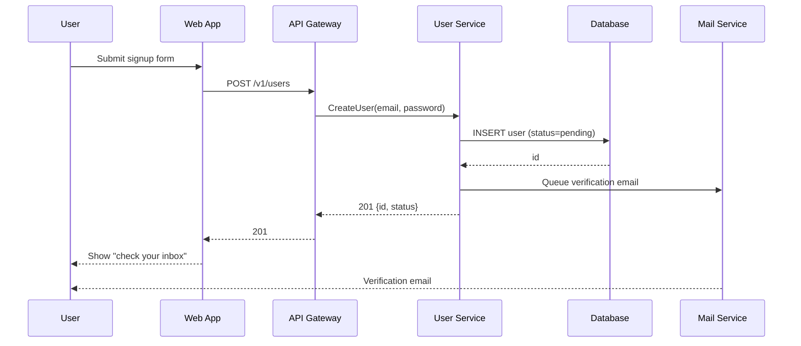
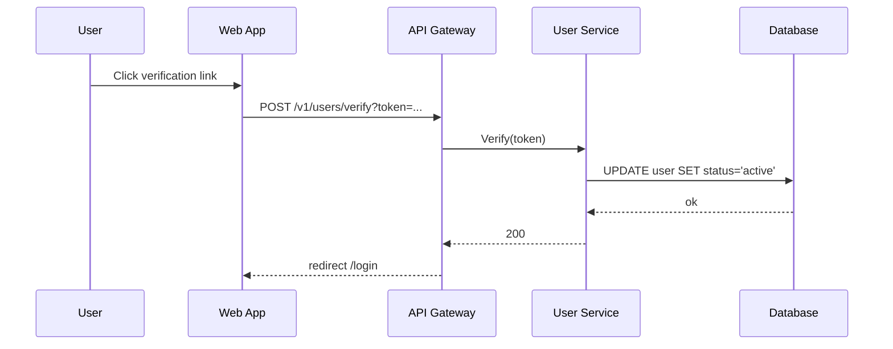

# Sequence Diagrams

Use Mermaid so diagrams live in source control.

## SD-001 — User Registration (UC-001)



## SD-002 — Email Verification



## SD-003 — {{Next flow}}

```mermaid
sequenceDiagram
    {{...}}
```
