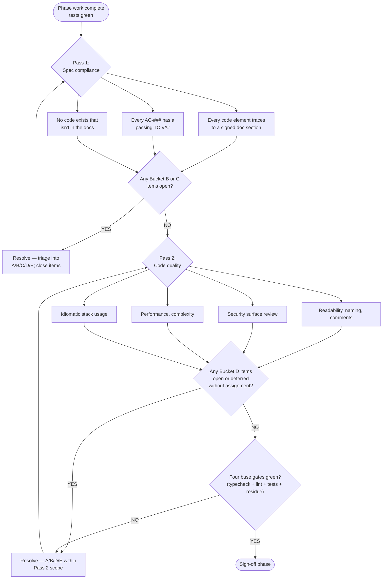

# The reconciliation gate (end of phase / version)

> Read this at every phase boundary and every version cut. Phase sign-off is BLOCKED until reconciliation closes **with Pass 1 before Pass 2**.

**Trigger:** Run after every phase's tests are green AND before the phase is signed off. Run again at version cut. Specifically, the audit fires when ALL of:

- Every TO-### in `task_list.md` for the phase is done
- Every `docs/sdlc/04_testing/test_cases.md` entry covering the phase passes
- The user is about to sign off Phase N → Phase N+1

The audit gate exists because TDD proves "the code works" but does NOT prove "the code matches the spec" — a green test from AC-001 can still pass against code that quietly added an extra field the docs never specified.

**Direction (non-negotiable):** This is a CODE-vs-DOC audit. The signed docs are the contract; the code is what gets compared against them. Never reverse the direction. Do not silently rewrite docs to match what shipped.

## Two passes, ordered



### Pass 1 — Spec compliance (open BEFORE Pass 2)

**Question asked:** "Does every line of code trace to a signed doc, and does every signed AC have a passing TC?"

**Scope:**
- Walk every doc in 01/02/03 that authorized this phase's work.
- For each statement that touches code (rule, count, name, shape, flow, error code, response field), check the code.
- List every mismatch as a candidate, including "silent additions" (code that exists with no doc parent).
- Verify each `AC-###` in `acceptance_criteria.md` has a mapped, passing `TC-###`.

**Exit condition:** Buckets B and C are empty (i.e., no unresolved correctness divergence, no undocumented code). Buckets A (rule violations), D (deferred with assignment), E (accepted with rationale) may have items — as long as each is assigned a next step.

### Pass 2 — Code quality (opens ONLY after Pass 1 closes)

**Question asked:** "Is the code any good?"

**Scope:**
- Readability: naming, function length, comment discipline
- Security surface: input validation at boundaries, injection-safe queries, secrets hygiene
- Performance: complexity, hot paths, resource leaks
- Idiomatic use of the stack (per `docs/sdlc/03_implementation/coding_standards.md`)

**Exit condition:** Bucket D items (quality concerns) either fixed or explicitly deferred with owner and target version. A and B within Pass 2 scope are closed.

**Why the order matters:** Fixing a naming issue on code that's solving the wrong problem is waste. Pass 1 answers "are we solving the right problem?" before Pass 2 asks "are we solving it well?"

## The five buckets

Applied WITHIN each pass — NOT across them. Pass 1 uses A/B/C/D/E scoped to provenance concerns; Pass 2 uses A/B/D/E scoped to quality concerns.

| Bucket | Meaning | Default action |
| --- | --- | --- |
| **A** | Code violates a documented rule (security, NFR, lint, coding standard) | Fix the code via TDD (failing test from the violated rule, then fix). Doc unchanged. |
| **B** | Code and doc contradict on a correctness point | Decide direction WITH the user. If doc is right → fix code (TDD). If code is right and doc was wrong → invoke change protocol → amend the doc → no code change. |
| **C** | Doc is silent or outdated about behavior the code added (V2..VN evolution drift) | Amend the doc via `## Post-vX.Y.Z Amendments (YYYY-MM-DD)` section, with explicit user approval. Code unchanged. |
| **D** | Real divergence but resolution is non-trivial / out of scope | Defer. Record reason + revisit trigger ("next major", "when X lands") in the divergences log. Roll the item forward as a TO-### in `task_list.md`. |
| **E** | Intentional / acceptable as-is | Accept. Record explicit rationale so the next audit doesn't re-flag it. |

## The audit procedure (two-pass)

1. **Run Pass 1 first.** Generate the candidate divergence list focused on provenance (code ↔ signed docs). Triage into A/B/C/D/E. Surface to user. Resolve. Pass 1 closes when no B or C items remain open.

2. **Only then open Pass 2.** Generate the code-quality candidate list. Triage A/B/D/E (C rarely applies in Pass 2 — quality issues are code issues, not doc absences). Surface. Resolve.

3. **Resolve in order within each pass:** A (rule violations are highest urgency) → B (correctness) → C (doc amendments, Pass 1 only) → D (record + roll forward) → E (record + close).

4. **Re-verify after each fix:** typecheck, lint, full test suite green, **`python3 scripts/check_residue.py`** clean. If a fix broke another test, that's a Bucket B in the other direction — repeat triage on the breakage.

5. **Machine-enforceable structure:** the reconciliation report carries a YAML frontmatter block describing pass state:

   ```yaml
   ---
   reconciliation:
     phase: "03"
     pass1:
       status: closed      # open | closed
       buckets: { A: 0, B: 0, C: 0, D: 1, E: 2 }
     pass2:
       status: open
       buckets: { A: 0, B: 0, D: 0, E: 0 }
   ---
   ```

   `scripts/reconcile.py --sign-off <report>` refuses sign-off if Pass 2 is
   closed while Pass 1 has open items. This enforces the ordering mechanically.

## Output artifact

Append to a project-level `docs/sdlc/02_design/divergences.md` (or per-version
`divergences-vX.Y.Z.md`), structured as:

- §0 — YAML frontmatter with `reconciliation:` block (Pass 1 + Pass 2 status)
- §1..N (Pass 1) — provenance divergences by area
- §M..P (Pass 2) — quality divergences by area
- §X — Triage Buckets table per pass
- §Y — Resolution Log: per-item verdict + file refs + commit shas
- §Z — Verification: typecheck, lint, tests, residue + counts

## Sign-off the audit itself

Once both passes are closed:

> "Reconciliation closed for Phase N (or vX.Y.Z) on YYYY-MM-DD by <name>."
>
> Pass 1 closed: YYYY-MM-DD. Pass 2 closed: YYYY-MM-DD.

Only THEN can Phase N be signed off and Phase N+1 open. Optionally bump patch version (e.g., v1.0.0 → v1.0.1 captures the reconciliation pass cleanly).

## Self-review pass (pre-reconciliation)

After writing ANY phase artifact (srs, architecture, test_plan, release_notes, etc.), the author runs a 4-question self-review **before** requesting sign-off. This catches common defects early; missing self-review is a Bucket C violation in reconciliation Pass 1.

1. **Placeholders:** any `{{PLACEHOLDER}}` / `TODO` / `FIXME` / `XXX` / `<TBD>` / `[to-be-filled]` remaining? Fix inline; `scripts/check_residue.py` must exit 0.
2. **Contradictions:** do sections contradict each other or other signed docs?
3. **Scope:** is this focused, or does it need decomposition into sub-specs?
4. **Ambiguity:** can any requirement be interpreted two ways? Pick one, make it explicit.

Agent opening the sign-off request MUST cite the self-review outcome:

```
Spec self-review (4 questions):
  Placeholders: none (check_residue exited 0)
  Contradictions: none
  Scope: focused (3 FRs, 1 NFR; single-implementation-plan candidate)
  Ambiguity: none — <any resolved items listed here>
```

Missing block = Pass 1 Bucket C. Add block; resume.

## Anti-patterns specific to reconciliation

- **Opening Pass 2 while Pass 1 has open B/C items** — enforced mechanically by `scripts/reconcile.py`; bypassing the script is a Rule 9 violation.
- **Conflating Pass 1 and Pass 2 bucket counts** — each pass triages independently.
- **Defaulting Bucket B/C to "amend the doc"** because it's less work — every direction call must be explicit; otherwise you launder shipped-but-unspec'd behavior into the spec retroactively.
- **Skipping items because "they're small"** — small divergences compound. The v1.0.0 audit found 30+ items, most individually trivial.
- **Marking E without rationale** — a future audit will re-flag the same items if you don't record why you accepted them.
- **Running the audit AFTER phase sign-off** — once Phase N is signed without an audit, the divergences become baseline and harder to dislodge.
- **Letting the agent triage Bucket B alone** — "whose side is right" is a user decision, not an agent decision.
- **Self-review as box-tick** — if you aren't finding placeholders, contradictions, scope issues, or ambiguity in ANY artifact, you aren't actually re-reading it with fresh eyes. Be honest.
